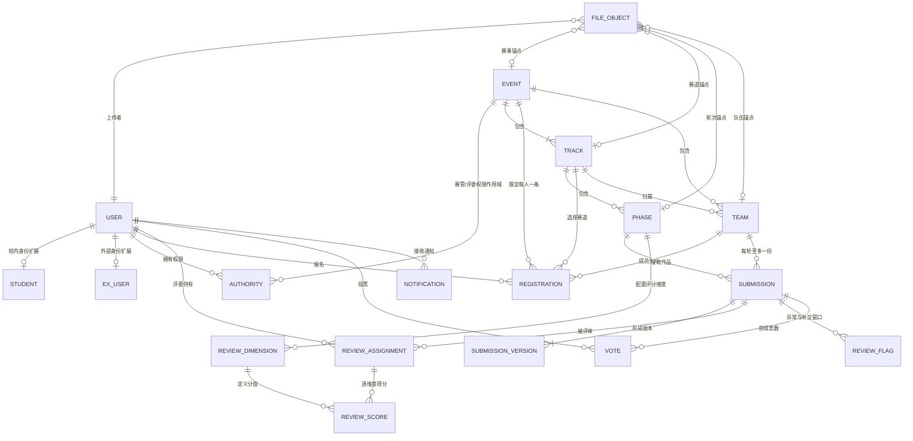
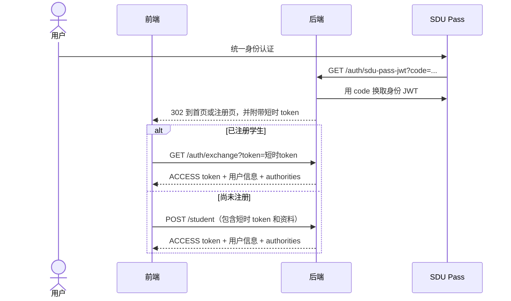
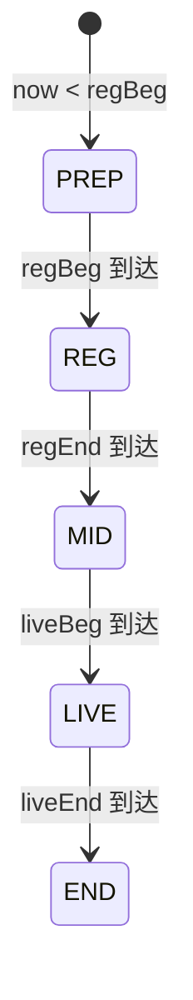
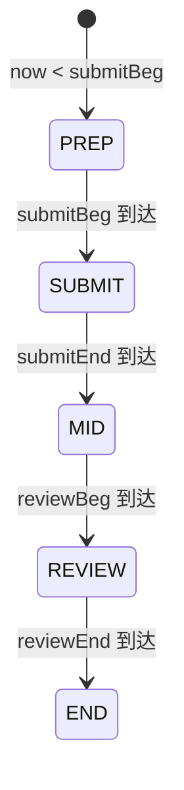
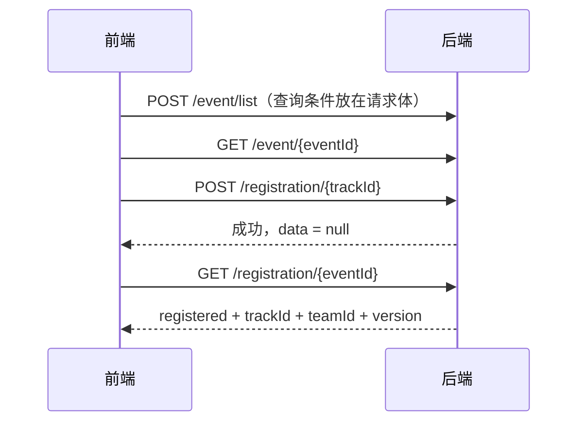
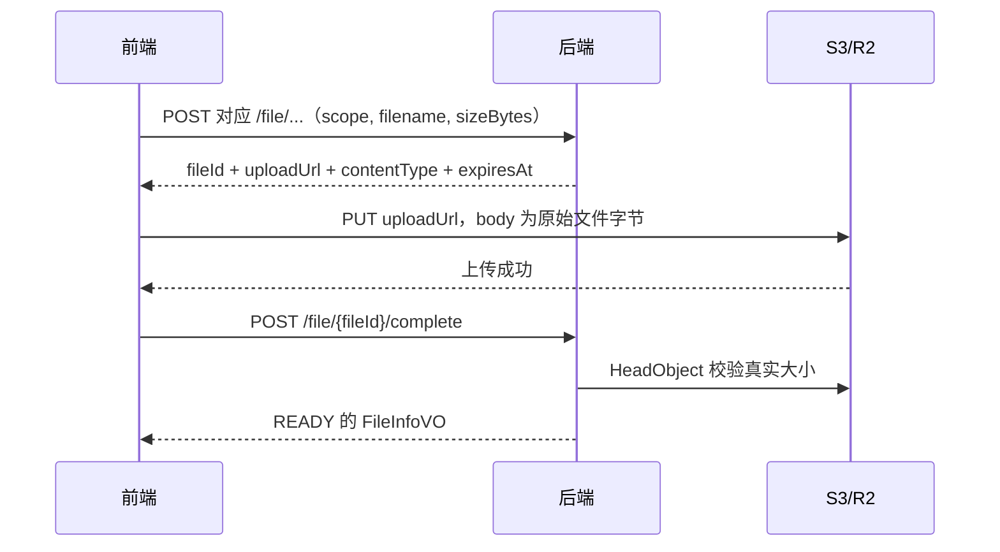
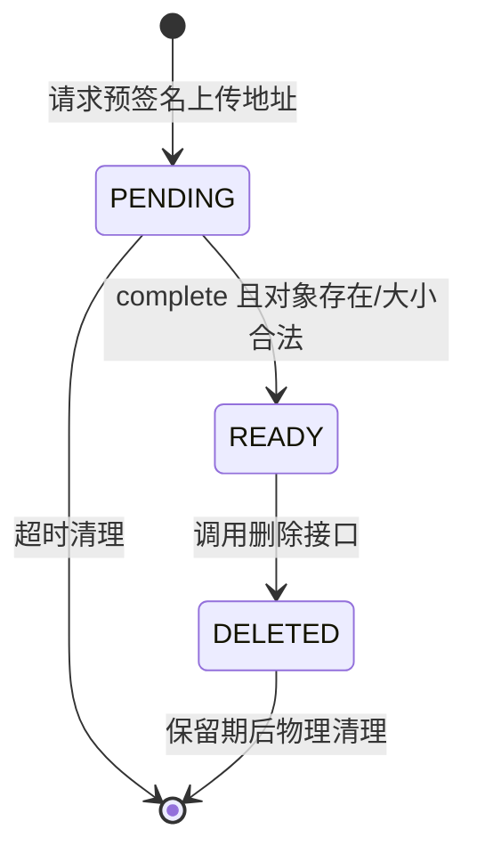
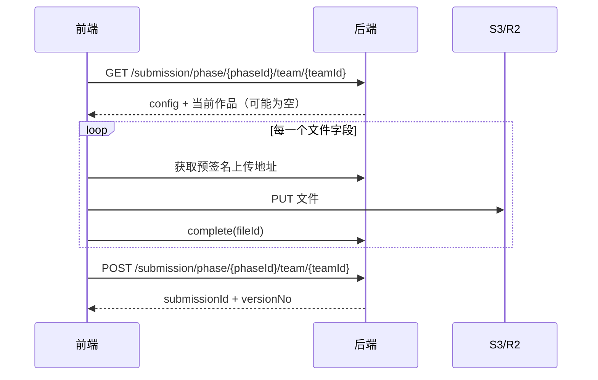
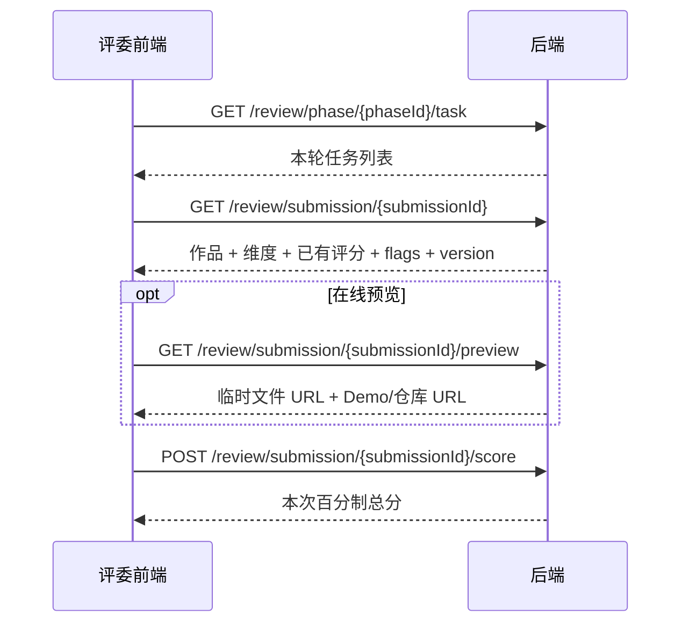
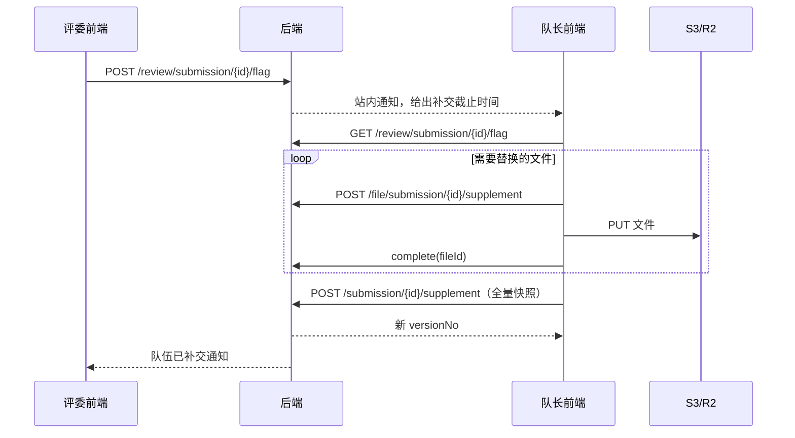

# 领域模型与业务流程说明

> 面向前端开发。本文说明当前后端代码实际实现的领域关系、状态变化、权限和调用顺序。
> 精确的字段类型、请求参数和响应 Schema 请同时参考 [`openapi.yaml`](./openapi.yaml)。

## 1. 先建立整体心智模型

系统的主轴不是“用户直接提交一个作品”，而是：

1. 超级管理员创建赛事；
2. 赛事管理员在赛事下创建赛道，在赛道下创建轮次；
3. 学生报名赛事中的一个赛道，并通过报名记录组成队伍；
4. 一个队伍在一个轮次中最多有一份当前作品；
5. 当前作品每次提交都会产生一个不可变的历史版本；
6. 赛事管理员把评委指派给作品，评委按轮次配置的维度打分；
7. 评委可以标记作品文件或 Demo 异常，从而为队长开启一次受限补交窗口；
8. 开启大众投票的轮次还可以接受投票并形成独立的人气榜。



### 1.1 持久化模型字典

| 模型 | 业务职责 | 关键关系或约束 |
| --- | --- | --- |
| `User` | 所有账号的公共主体 | 手机号唯一、邮箱唯一；通过 `studentFlag` 区分学生与外部账号 |
| `Student` | 学生身份资料 | 与 User 一对一；`casId` 唯一 |
| `ExUser` | 外部账号扩展资料 | 与 User 一对一；外部赛管、评委等账号使用 |
| `StudentTag` | 可选学生标签字典 | 当前 Student 以逗号分隔字符串保存已选标签，不是关联表 |
| `Authority` | 全局或赛事级授权 | `(userId, type, eventId)` 唯一；SUPER 的 eventId 为空 |
| `Event` | 赛事聚合根 | 名称唯一；定义报名和赛事总时间范围 |
| `Track` | 赛事中的赛道 | `(eventId, name)` 唯一 |
| `Phase` | 赛道中的轮次 | `(trackId, name)` 唯一；保存提交、评审、投票时间和提交配置 JSON |
| `Registration` | 学生报名与队伍成员关系 | `(userId, eventId)` 唯一；`teamId` 为空表示尚未组队 |
| `Team` | 某赛道中的参赛队伍 | `(trackId, name)` 唯一；保存队长、人数、协同类型和预留晋级状态 |
| `FileObject` | 对象存储文件的元数据和生命周期 | `objectKey` 唯一；通过用户/赛事/赛道/轮次/队伍锚点控制归属和读取权限 |
| `Submission` | 队伍在某轮次的当前作品快照 | `(phaseId, teamId)` 唯一；内容会在重新提交时整体覆盖 |
| `SubmissionVersion` | 某次提交的不可变历史快照 | `(submissionId, versionNo)` 唯一；保存 JSON snapshot、提交人和 changeLog |
| `ReviewDimension` | 轮次评分维度 | `(phaseId, name)` 唯一；定义满分、权重和展示顺序 |
| `ReviewAssignment` | 评委与作品之间的评审任务 | `(submissionId, judgeId)` 唯一；保存任务状态、总分、总评和回避/移交追踪 |
| `ReviewScore` | 一条任务在一个维度上的得分 | `(assignmentId, dimensionId)` 唯一 |
| `ReviewFlag` | 作品异常及其补交窗口 | 保存 target、窗口截止时间、解决版本和关闭原因 |
| `Notification` | 只追加的站内通知 | 按接收人隔离；业务锚点供前端深链跳转 |
| `Vote` | 用户对作品的一票 | `(userId, submissionId)` 唯一；`voteDate` 用于计算每日上限 |

### 1.2 非独立数据表的值对象

| 值对象 | 存放位置 | 作用 |
| --- | --- | --- |
| `SubmissionConfig` | `phase.submission_config` JSON | 决定本轮动态表单开启哪些作品提交项及文件大小/许可限制 |
| `SubmissionSnapshot` | `submission_version.snapshot` JSON | 固化某一版本的全部作品内容和文件 ID |

这些值对象虽然有 Java 类，但没有独立 ID，也不能通过单独 API 查询或修改。`SubmissionConfig` 随 Phase 更新，`SubmissionSnapshot` 随提交版本生成。

其中最容易被前端误解的关系是：

- `Registration` 不只是“报名结果”，它同时承担队伍成员关联。`registration.teamId != null` 即表示该学生已加入队伍。
- `Submission` 是当前作品快照，`SubmissionVersion` 是每次提交时保存的不可变历史快照。
- `ReviewAssignment` 是“某位评委评某份作品”的任务，不是评分本身；逐维度分数保存在 `ReviewScore`。
- `FileObject` 是独立的文件生命周期记录。先完成文件上传，作品提交时才能引用相应 `fileId`。
- 赛事和轮次的展示状态由当前时间推导，不是由前端写入的状态字段。

## 2. 通用 API 与前端约定

### 2.1 统一响应

除 SDU Pass 的 302 回调外，业务接口统一返回：

```json
{
  "code": 200,
  "data": {},
  "msg": "获取成功"
}
```

- HTTP 状态码表达协议层结果，例如 400、401、403、404、409、413、500。
- `code` 是后端业务码。成功固定为 `200`，失败时不是 HTTP 状态码的简单复制。
- 前端请求层应同时判断 HTTP 状态和响应体 `code`，并优先向用户展示后端返回的 `msg`。
- 删除、更新等无返回数据的成功响应仍有响应体，`data` 为 `null`。

### 2.2 身份令牌

登录成功后使用：

```http
Authorization: Bearer <access-token>
```

后端虽然兼容不带 `Bearer ` 前缀的令牌，但前端应始终使用标准 Bearer 格式。

后端会在所有请求上解析令牌，包括公开接口。因此：

- 不携带令牌可以匿名访问公开接口；
- 携带有效令牌可以获得与身份相关的视图，例如投票榜中的 `voted`；
- 携带过期或损坏的令牌，即使访问公开接口也会返回令牌错误；
- 前端发现令牌过期后应清理本地令牌，再按匿名状态重试允许匿名访问的页面。

### 2.3 路径 ID 是业务上下文

后端通过路径中的 `eventId`、`trackId`、`phaseId`、`teamId`、`submissionId` 建立 `Context`，并检查这些资源是否真的属于同一条业务链。

例如：

```text
eventId -> trackId -> phaseId
eventId -> trackId -> teamId
phaseId + teamId -> submissionId
```

前端不能把不同赛事或不同赛道中的 ID 随意拼接。资源存在但上下文不一致时，后端通常按“资源不存在”处理，以避免泄露跨赛事信息。

### 2.4 乐观锁版本号

多个可修改模型带有 `version`。前端必须把最近一次 GET 返回的 `version` 原样带到更新请求中：

| 模型 | 获取版本的响应 | 使用版本的请求 |
| --- | --- | --- |
| Event | `EventInfoVO.version` | `UpdateEventDTO.version` |
| Track | `TrackInfoVO.version` | `UpdateTrackDTO.version` |
| Phase | `PhaseInfoVO.version` | `UpdatePhaseDTO.version`、`UpdatePhaseConfigDTO.version` |
| Registration | `RegistrationVO.version` | `UpdateRegistrationDTO.version` |
| Team | `TeamInfoVO.version` | `UpdateTeamDTO.version` |
| Submission | `SubmissionInfoVO.version` | 再次提交或补交时 `SubmitWorkDTO.version` |
| ReviewDimension | `DimensionVO.version` | `UpdateDimensionDTO.version` |
| ReviewAssignment | `ReviewWorkVO.version` | 已打过分后再次打分时 `ScoreWorkDTO.version` |

版本冲突返回业务码 `4002`。前端不要自动覆盖，应重新获取最新数据，并让用户确认是否再次提交。

### 2.5 时间格式

后端使用 `LocalDateTime`，JSON 示例为：

```text
2026-08-30T14:30:00
```

该值不带 `Z` 或 UTC 偏移。当前业务按服务端本地时间运行，前端不要擅自把它当作 UTC；展示和提交前应采用统一的赛事时区约定。

## 3. 身份与权限领域

### 3.1 User、Student 与 ExUser

`User` 保存所有账号共有的信息：姓名、密码、校内标记、手机和邮箱。

- `studentFlag = true`：用户拥有一条 `Student` 扩展记录，包含学号、校区、专业、简介和标签。
- `studentFlag = false`：用户拥有一条 `ExUser` 扩展记录，包含是否校内人员及组织名称。

这里的“外部用户”是账号类型，不等同于“没有任何赛事权限”。外部账号仍可以被授予赛事管理员或赛事评委权限。

### 3.2 Authority

权限分为：

| 权限 | 作用域 | 说明 |
| --- | --- | --- |
| `SUPER` | 全局 | 创建赛事、创建或删除其他超管、管理赛事管理员 |
| `ADMIN` | 单个赛事 | 管理该赛事的赛道、轮次、评委、作品和结果 |
| `JUDGE` | 单个赛事 | 可以进入该赛事评委工作台，但仍须被指派后才能评具体作品 |

`LoginVO.authorities` 只包含 `SUPER/ADMIN/JUDGE` 权限。队长、队员、作品所有者和“已指派评委”都是根据当前路径资源实时计算的，不会被编码在登录响应中。

### 3.3 运行时角色

| 角色 | 判定方式 |
| --- | --- |
| `LOGGED_IN` | 有有效 ACCESS 令牌 |
| `STUDENT` | 已登录且 `studentFlag = true` |
| `EXTERN` | 已登录且 `studentFlag = false` |
| `SELF` | 路径 `userId` 等于当前用户 |
| `EVENT_ADMIN` | 当前用户在路径所定位赛事中拥有 ADMIN 权限 |
| `EVENT_JUDGE` | 当前用户在路径所定位赛事中拥有 JUDGE 权限 |
| `TEAM_MEMBER` | 当前用户的报名记录绑定当前队伍 |
| `TEAM_LEADER` | 当前用户等于队伍 `leaderId` |
| `ASSIGNED_JUDGE` | 当前评委持有该作品的 PENDING 或 DONE 任务 |
| `SUBMISSION_OWNER` | 当前用户是作品所属队伍成员 |

前端的权限判断适合用来控制导航和按钮可见性，但最终权限必须以后端响应为准。

## 4. 登录与注册流程

### 4.1 SDU Pass 登录



前端要区分两类短时令牌：

- 已注册学生获得 `EXCHANGE` 类型短时令牌，只能调用 `/auth/exchange`；
- 未注册身份获得 `REGISTER` 类型短时令牌，只能放在 `/student` 注册请求中。

短时令牌不是 ACCESS token，不能直接放进普通 API 的 Authorization 请求头。

### 4.2 账号密码登录

`POST /auth/login` 的 `term` 支持：

- 12 位数字：按学号查找学生；
- 中国大陆手机号格式：按手机号查找；
- 其他字符串：按邮箱查找。

学生注册时密码是可选的。未设置密码的账号使用本地登录会返回 `1114 PASSWORD_UNSET`，应继续使用 SDU Pass 登录或先通过已有登录态设置密码。

## 5. 赛事结构领域

### 5.1 Event、Track、Phase

层级固定为：

```text
Event（赛事）
└── Track（赛道）
    └── Phase（轮次）
```

- 一个赛事有多个赛道；同一赛事中的赛道名称唯一。
- 一个赛道有多个不重叠轮次；同一赛道中的轮次名称唯一。
- 轮次的提交和评审时间必须位于赛事 `liveBeg` 至 `liveEnd` 内。
- 同一赛道中的两个轮次不能在“提交开始到评审结束”的整个区间上重叠。

### 5.2 赛事状态是时间派生值



| 状态值 | 中文响应 | 含义 |
| --- | --- | --- |
| `PREP` | 赛前准备 | 报名尚未开始 |
| `REG` | 报名阶段 | 可以报名、改赛道、取消报名 |
| `MID` | 赛前休整 | 报名结束、赛事尚未开始 |
| `LIVE` | 赛事进行 | 队伍结构不再允许修改 |
| `END` | 赛事结束 | 赛事已结束 |

前端不能提交一个 `status` 去改变赛事状态。

### 5.3 轮次状态也是时间派生值



大众投票使用独立的 `pollBeg/pollEnd`，不要求与上述五个展示状态完全重合，但必须满足起止时间有效。

### 5.4 赛事管理员配置顺序

推荐的前端向导顺序是：

1. 超管调用 `POST /event` 创建赛事；
2. 赛管调用 `POST /event/{eventId}/track` 创建赛道；
3. 赛管调用 `POST /track/{trackId}/phase` 创建轮次；
4. 赛管调用 `PUT /phase/{phaseId}/config` 配置本轮要求提交哪些材料；
5. 赛管通过 `/review/phase/{phaseId}/dimension` 配置评分维度；
6. 超管或赛管创建外部账号并授予赛管/评委权限；
7. 等作品提交后，再进行评委指派。

新建轮次时后端会创建一个所有提交项均关闭的 `SubmissionConfig`。因此创建轮次成功不代表提交表单已经配置完成。

## 6. 报名与队伍领域

### 6.1 Registration 是报名和成员关系的共同载体

数据库约束为“一个用户在一个赛事中最多一条报名记录”。报名记录包含：

- `eventId`：报名的赛事；
- `trackId`：选择的赛道；
- `teamId`：当前所属队伍，未组队时为 `null`；
- `version`：改赛道时使用的乐观锁版本。

因此系统没有单独的 `team_member` 表。队伍成员列表由所有 `registration.teamId = 当前队伍` 的报名记录计算得出。

### 6.2 学生报名流程



注意：

- 创建报名只有在赛事 `REG` 时间窗内可用；
- `GET /registration/{eventId}` 在报名前也返回 200，此时 `registered = false`；
- 只有尚未组队且仍处于报名阶段时，才能修改赛道或取消报名；
- 加入队伍后若要改赛道，必须先离队。

### 6.3 组队流程

创建队伍：

1. 学生必须已报名该 `trackId`；
2. 学生当前不能属于其他队伍；
3. `POST /team/{trackId}` 创建队伍；
4. 创建者自动成为队长，其报名记录自动绑定新 `teamId`。

加入队伍有四种 API 表达：

- 本人加入：`POST /team/{teamId}/join`；
- 私密邀请码：`POST /team/join-code`；
- 队长发送待确认邀请：`POST /team/{teamId}/invite`，选手通过邀请接受接口确认；
- 选手申请招募缺口，队长或赛管审批通过后入队。

两种方式最终执行相同的入队规则：

- 被加入者必须是学生；
- 必须已报名同一赛事的同一赛道；
- 不能已有队伍；
- 队伍不能超过赛事 `teamMaxSize`；默认上下限为 1–5，赛管可在赛事开始前配置；
- `同专业` 队伍要求与队长专业一致；
- `同专业`、`跨专业` 队伍要求与队长校区一致；只有 `跨校区` 允许跨校区。

赛事开始后，创建、修改、加入、离开、踢人和解散队伍都被禁止。

### 6.4 人才招募与管理员干预

- 队长可发布、修改、关闭和删除人才缺口，选手可按赛道、关键词和技能检索；
- 未组队选手可申请缺口，队长或赛管查看并接受/拒绝，处理结果通过站内通知下发；
- 未组队选手可发布自荐名片，队长按赛道、关键词和技能浏览并发送待确认邀请；
- 未组队选手还可按队名模糊检索可加入队伍；结果自动限制为本人报名赛道内、状态有效且未满员的队伍，实际加入时继续校验专业和校区规则；
- 创建队伍自动生成 12 位私密邀请码，队长或赛管可刷新，旧码立即失效；
- 赛管可分页检索赛事队伍，并可人工添加/移出成员、修改或解散队伍；
- 当前队长可将队长职责转让给本队其他成员；赛管也可把任一本队成员设置为队长；
- 每支队伍始终只有一个 `leaderId`，变更后原队长保留普通队员身份；
- 赛事最小人数在首次提交作品时校验，未达到下限的队伍仍可在赛前继续招募。

## 7. 文件领域

### 7.1 文件不是 multipart 上传

文件采用对象存储直传，完整流程必须有三步：



前端必须使用后端返回的 `contentType` 执行 PUT。仅拿到 `fileId` 不代表上传完成，作品只能引用 `READY` 文件。

### 7.2 FileObject 状态



- `PENDING`：数据库已有记录，但对象可能尚未上传；
- `READY`：完成 HeadObject 校验，可以被业务引用；
- `DELETED`：逻辑删除，保留期后由定时任务删除对象和数据库记录。

未完成上传记录默认每天凌晨清理；逻辑删除记录也按配置的保留小时数延迟清理。

### 7.3 scope 与上传入口必须匹配

`UploadDTO.scope` 不是任意值。不同 URL 只接受属于对应分组的 scope：

| 上传入口 | 常用 scope | 业务锚点 |
| --- | --- | --- |
| `/file/avatar` | `AVATAR` | 当前用户 |
| `/file/event/{eventId}` | `EVENT_COVER` | 赛事 |
| `/file/track/{trackId}` | `TRACK_ATTACHMENT` | 赛道/赛事 |
| `/file/phase/{phaseId}/team/{teamId}/submit` | `SUBMIT_ARCHIVE`、`SUBMIT_VIDEO`、`SUBMIT_DOC`、`SUBMIT_IMAGE`、`MILESTONE` | 轮次/队伍 |
| `/file/submission/{submissionId}/supplement` | 同上 | 作品对应的轮次/队伍 |
| `/file/phase/{phaseId}/team/{teamId}/appeal` | `APPEAL` | 作品对应的轮次/队伍 |
| `/file/team/{teamId}/showcase` | `SHOWCASE` | 队伍 |

作品提交时，后端会再次检查文件的状态、scope、轮次、队伍和大小。前端不能把其他队伍或其他轮次上传的 `fileId` 复用到当前作品。

## 8. 作品提交领域

### 8.1 SubmissionConfig 驱动动态表单

前端进入提交页时，第一步应调用：

```http
GET /submission/phase/{phaseId}/team/{teamId}
```

即使队伍还没有提交过作品，响应也会包含 `config`、轮次信息和 `editable`。前端必须根据 `config` 动态显示字段：

| 配置字段 | 打开后要求的提交内容 |
| --- | --- |
| `repository` | `repoUrl`，必须是 http/https URL |
| `openSource` | `licenseType`，并可限制允许的协议列表；`derivedFrom` 可选 |
| `zip` | 已完成上传的 `SUBMIT_ARCHIVE` 文件 ID |
| `video` | `SUBMIT_VIDEO` 文件 ID 或 `videoUrl`，二选一且必须有一个 |
| `powerpoint` | 已完成上传的 `SUBMIT_DOC` 文件 ID |
| `website` | `demoUrl`，必须是 http/https URL |
| `markdown` | `introMd` |
| `declare` | `declaration` |

未开启的字段不只是“不必填”，而是禁止提交。前端应从请求体中彻底移除这些字段，不要发送空字符串以外的残留值。

### 8.2 首次提交与重新提交



首次提交：

- 不传 `version`；
- 创建 `Submission`；
- `versionNo = 1`；
- 同时写入 `SubmissionVersion(v1)`。

重新提交：

- 必须传当前 `SubmissionInfoVO.version`；
- 当前作品内容被新快照整体覆盖；
- `versionNo` 加 1；
- 写入新的历史版本，旧版本不会被覆盖。

作品是全量快照提交，不是 PATCH。重新提交时前端应提交本轮配置要求的全部内容，不能只提交变化字段。

### 8.3 提交锁定

正常提交要求：

- 当前用户是队长；
- 当前时间位于 `submitBeg <= now <= submitEnd`；
- 作品尚未锁定。

提交截止后：

- 查询时会立即把作品派生为 `LOCKED`；
- 每 5 分钟运行的定时任务把数据库状态正式更新为 `LOCKED`；
- 即使定时任务尚未执行，后端也不会允许继续走普通提交接口。

因此前端不要依赖本地倒计时决定是否可提交，应同时使用响应中的 `editable` 并处理后端的时间窗错误。

### 8.4 版本历史

- `GET /submission/{submissionId}/version`：返回 v1、v2……的摘要；
- `GET /submission/{submissionId}/version/{versionNo}`：返回某个版本的完整 `SubmissionSnapshot`；
- 当前作品和历史版本使用相同内容字段，但历史快照不包含文件详情，只保留文件 ID。

盲审视角下，队名会变成 `Team-<编号>`，提交人姓名不会下发。

## 9. 评审领域

### 9.1 评分维度

每个轮次独立配置评分维度：名称、说明、满分、权重和顺序。

评委总分归一为百分制：

```text
总分 = Σ(维度得分 / 维度满分 × 维度权重) / Σ维度权重 × 100
```

最终保留两位小数。只要本轮已经产生任何 `ReviewScore`，维度就全部锁定，不能再新增、修改或删除。

### 9.2 评委与评审任务是两层权限

获得赛事 `JUDGE` 权限只代表“是该赛事评委”。要评某份作品，还必须存在一条自己持有的 `ReviewAssignment`。

```text
EVENT_JUDGE + PENDING/DONE assignment
            = ASSIGNED_JUDGE
```

`RECUSED` 和 `TRANSFERRED` 是终态，原评委不再持有该作品。

### 9.3 指派方式

赛事管理员有两种方式：

- 手工批量指派：评委 ID 列表 × 作品 ID 列表；
- 自动补齐：为每份作品补齐到指定评委数。

自动选择评委时会排除：

1. 作品所属队伍的队长和全部队员；
2. 曾经接触过该作品的评委，包括已回避和已移交者；
3. 已经有该作品任务的评委。

剩余候选按“本轮当前持有任务数升序、用户 ID 升序”选择，以保证负载较均衡且结果可重复。

### 9.4 评委工作台流程



打分请求必须：

- 覆盖本轮全部维度；
- 每个维度只出现一次；
- 不包含其他轮次的维度；
- 分数不超过该维度满分；
- 位于评审时间窗；
- 首次打分可不传 `version`，覆盖已有打分时必须传 `ReviewWorkVO.version`。

重复打分采用整体覆盖：后端先删除该任务的旧维度分，再写入新分数。

### 9.5 盲审

当 `phase.blindReview = true` 且访问者是普通赛事评委而不是赛事管理员时：

- 队名替换为稳定的 `Team-<编号>`；
- 队伍成员不下发；
- 提交人姓名不下发；
- 下载文件名会匿名化；
- 异常标记中的评委姓名不下发。

赛事管理员始终看到完整视图。

### 9.6 回避、重新分发与移交

评委回避：

1. 评委提交回避理由；
2. 原任务变为 `RECUSED`；
3. 系统按自动选择规则寻找接手评委；
4. 新建 `REDISTRIBUTE` 来源的任务并通知新评委；
5. 若无人可接手，回避仍成功，但系统通知赛事管理员人工处理。

管理员移交：

1. 选择仍为 `PENDING` 或 `DONE` 的旧任务；
2. 指定接手评委，或让系统自动选择；
3. 旧任务变为 `TRANSFERRED`；
4. 新建 `TRANSFER` 来源的任务；
5. 原评委和新评委都会收到通知。

同一评委一旦对某作品存在过任务记录，就不会再次被分配该作品。

### 9.7 最终计分

只统计状态为 `DONE` 且存在总分的任务：

- 已完成评委少于 5 人：所有有效总分直接取平均；
- 已完成评委不少于 5 人：剔除一个最低分和一个最高分，再取平均；
- 同分时按 assignmentId 保证剔除结果稳定；
- 没有任何完成评分时 `finalScore = null`。

`GET /review/phase/{phaseId}/result` 返回的列表按最终得分降序，未得分作品排在后面。

## 10. 异常标记与补交流程

补交不是“重新打开普通提交”。它是由评委异常标记驱动的独立豁免流程。



异常标记规则：

- 只有被指派评委能在评审时间窗中创建；
- 只能标记本轮确实启用的提交项；
- 同一作品、同一 target 同时最多一个未处理标记；
- 默认窗口 24 小时，调用方最多请求 72 小时；
- 窗口不会越过本轮 `reviewEnd`。

补交规则：

- 只有队长可操作；
- 必须存在至少一个尚未过期的 OPEN 标记；
- 必须提供当前作品 `version`；
- `changeLog` 必填，并在历史版本中添加“【补交】”前缀；
- 必须提交完整作品快照，不是只传损坏字段；
- 补交增加 `versionNo`，但不解除或改变作品的 LOCKED 状态；
- 一次补交会把当前所有仍有效的 OPEN 标记一起置为 `RESOLVED`，并记录解决它们的版本号。

管理员可提前关闭窗口。未处理窗口到期后由每 5 分钟运行的任务置为 `CLOSED` 并通知队长。

## 11. 投票与通知领域

### 11.1 大众投票

投票由轮次的 `poll`、`pollBeg`、`pollEnd` 和 `pollDailyCap` 控制。

- 每个用户对同一作品最多一票；
- 每个用户在同一轮次每天有票数上限；
- `pollDailyCap` 为空时默认每天 3 票；
- 排行按票数降序，同票按 `submissionId` 升序；
- 未开启投票的轮次，排行榜返回空数组；
- 匿名可看排行榜，`voted = null`；登录后 `voted` 表示本人是否投过。

代码中的投票权限实际是 `LOGGED_IN`，没有进一步检查 `STUDENT` 或 CAS 身份。前端不要仅根据接口注释假设只有学生可以投票；如产品规则要求限制 CAS 学生，需要后端另行收紧。

### 11.2 站内通知

通知目前由评审相关动作产生：

- 回避后的自动重新分发；
- 管理员移交评审任务；
- 打分催办；
- 作品异常和补交完成；
- 补交窗口关闭。

当前手工批量指派和自动补齐只创建 `ReviewAssignment`，不会立即向初始评委写入站内通知；评委工作台需要主动查询任务列表。回避后的重新分发和管理员移交才会通知接手评委。

每条通知带有可选的 `eventId`、`phaseId`、`submissionId` 和 `refId`，前端应优先使用这些锚点构造深链跳转，而不是解析通知正文。

通知只能读取和修改当前用户自己的记录。`PUT /notification/read` 不传请求体或不传 ID 列表时，会把当前用户的全部未读通知标记为已读。

## 12. 当前实现边界：不要从字段推断不存在的流程

下面这些能力有部分模型或文件类型，但当前 API 尚未形成完整业务闭环。

### 12.1 晋级与轮次推进

`Phase` 有 `manualPick`、`passRate`，`Team` 有 `status`、`currentPhaseId`，但当前没有：

- 根据评分自动计算晋级队伍；
- 手工选择晋级队伍；
- 更新队伍 `ACTIVE/FAILED` 状态；
- 把晋级队伍推进到下一轮。

评审结果接口只计算并返回分数，不会改变队伍状态。

### 12.2 中期打卡

`midCheck` 会决定 `MILESTONE` scope 文件是否允许上传，但当前没有独立的打卡记录、打卡提交、打卡列表或审核状态。上传一个 `MILESTONE` 文件不等于完成了完整的中期打卡业务。

### 12.3 申诉

当前只有申诉文件预签名入口 `/file/phase/{phaseId}/team/{teamId}/appeal`，没有申诉单模型、申诉提交、处理状态或管理员处理接口。

另外，申诉文件入口依赖 `phase.publicityEnd`，但当前创建/修改轮次 DTO 没有配置该字段的入口。因此不要把该文件接口视为可直接使用的完整申诉流程。

### 12.4 证书与导出

`FileScope` 预留了证书模板、印章、证书和导出文件类型，但没有证书生成、名单确认、批量发放或导出 Controller。`CERT_OWNER` 角色也尚未实现完整判定。

### 12.5 展示墙

存在队伍 `SHOWCASE` 文件上传入口，但没有展示资料绑定模型、展示项目列表或公开展示墙接口。

### 12.6 轮次配置回显不完整

`CreatePhaseDTO/UpdatePhaseDTO` 接受 `manualPick` 和 `passRate`，数据库也会保存；但当前 `PhaseInfoVO` 不返回这两个字段，也不返回 `publicityEnd`。

这意味着前端无法通过 `GET /phase/{phaseId}` 完整回显并安全编辑这些配置。实现轮次编辑页时，不应凭默认值覆盖未知字段；需要后端先补齐响应契约。

### 12.7 权限人员列表当前为公开接口

`GET /authority/event/{eventId}` 当前没有 `@Require`，匿名请求也可以获取赛事相关人员简表。前端可以按当前契约调用，但如果产品预期该信息受保护，需要后端调整权限，而不是只在前端隐藏入口。

### 12.8 学生标签不要省略

`CreateStudentDTO.tags` 和 `UpdateStudentDTO.tags` 在校验注解上不是必填，但当前服务实现会直接对它们执行 `String.join`。传 `null` 或省略字段可能触发 500。

前端当前应始终发送数组；没有标签时发送：

```json
{
  "tags": []
}
```

### 12.9 首次设置密码流程当前不闭合

学生注册允许不设置密码，但 `UpdatePasswordDTO.oldPassword` 的校验与服务判断不一致：

- 传 `null` 虽能通过 `@Size`，服务随后会调用 `oldPassword.isEmpty()`；
- 传空字符串又无法通过 `@Size(min = 6)`。

因此“无旧密码账号首次设置密码”当前没有可靠可用的请求形式，需要后端修正后再开放对应前端入口。已有密码的用户修改密码时应同时发送 6 至 20 位的旧密码和新密码。

### 12.10 本地登录返回的 casId 不是始终可靠

学生使用账号密码登录时，如果 `term` 传的是手机号或邮箱，当前服务会把该登录 term 写入 `LoginVO.casId`，而不是重新读取真实学号。只有使用 12 位学号登录时，该字段才可直接视为学号。

前端不要把本地登录响应中的 `casId` 当作稳定用户主键。当前 `LoginVO` 又没有返回 `userId`；如果前端确实需要当前用户 ID，应由后端在登录响应或独立的当前用户接口中明确返回，而不是用 `casId` 代替。

## 13. 前端页面与查询建议

建议以资源层级组织路由和缓存键：

```text
event/{eventId}
event/{eventId}/track/{trackId}
event/{eventId}/track/{trackId}/phase/{phaseId}
phase/{phaseId}/team/{teamId}/submission
review/phase/{phaseId}
review/submission/{submissionId}
```

建议的查询键示例：

```text
['event', eventId]
['track', trackId]
['phase', phaseId]
['registration', eventId, currentUserId]
['team', teamId]
['submission', phaseId, teamId]
['submission', submissionId, 'versions']
['review', phaseId, 'tasks']
['review', submissionId, 'work']
['review', phaseId, 'progress']
['vote', phaseId, 'ranking']
['notifications', currentUserId, page, unread]
```

完成写操作后，至少失效以下关联数据：

| 写操作 | 建议失效的查询 |
| --- | --- |
| 报名、改赛道、取消报名 | registration、event/track 相关报名视图 |
| 创建、加入、离开、踢人、解散队伍 | registration、team |
| 提交或补交作品 | submission 当前详情、versions、review work、flags |
| 指派、回避、移交 | review tasks、progress、notifications |
| 打分 | review work、tasks、progress、results |
| 创建或关闭异常标记 | flags、review work、notifications |
| 投票 | ranking、vote status |
| 标记通知已读 | notification page、unread count |

## 14. 前端实现检查清单

- 所有受保护请求统一携带 Bearer token；令牌失效时清理本地登录态。
- 不根据 `authorities` 推断队长、队员或已指派评委身份。
- 始终保持 event/track/phase/team/submission ID 来自同一业务链。
- 更新请求使用最近一次 GET 返回的 `version`。
- 提交表单严格由 `SubmissionConfig` 驱动，关闭的字段不发送。
- 文件必须完成“预签名 -> PUT -> complete”，只有 READY 文件才能进业务请求。
- 作品重新提交和补交都发送全量快照。
- 覆盖评分前重新获取 `ReviewWorkVO.version`。
- 时间窗和倒计时只用于用户提示，最终以服务端判断为准。
- 盲审页面不自行请求或缓存队伍身份信息。
- 通知跳转使用结构化锚点，不解析正文。
- 对“当前实现边界”中的能力，不在前端伪造仅本地存在的业务状态。

## 15. 代码位置索引

| 主题 | 主要代码 |
| --- | --- |
| HTTP 契约 | `controller/*Controller.java`、`data/dto`、`data/vo` |
| 身份与路径上下文 | `security/AuthInterceptor.java`、`security/Context.java`、`security/Role.java` |
| 赛事状态 | `data/po/Event.java`、`data/po/Phase.java` |
| 报名和队伍 | `RegistrationService.java`、`TeamService.java` |
| 文件生命周期 | `FileService.java`、`FileScope.java`、`FileCleanUpTask.java` |
| 作品与版本 | `SubmissionService.java`、`Submission.java`、`SubmissionLockTask.java` |
| 评分维度与计分 | `ReviewDimensionService.java`、`ReviewService.java` |
| 指派、回避和移交 | `ReviewAssignService.java` |
| 异常与补交 | `ReviewFlagService.java`、`SupplementWindowTask.java` |
| 投票 | `VoteService.java` |
| 通知 | `NotificationService.java` |
| 数据关系 | `src/main/resources/db/migration/V1__init_schema.sql` 至 `V8__vote.sql` |
